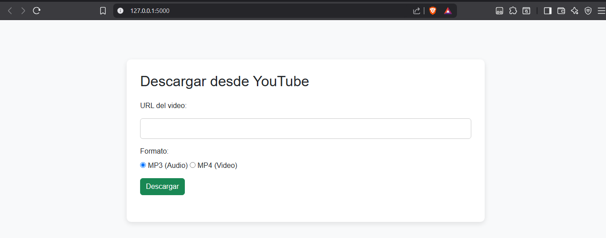
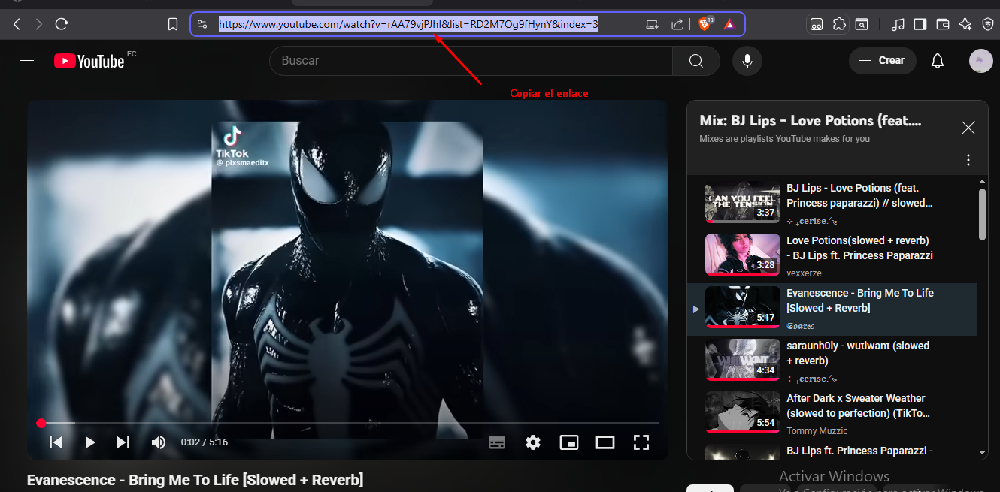
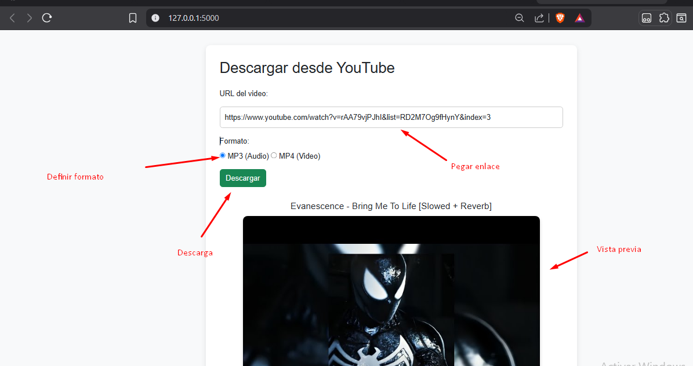
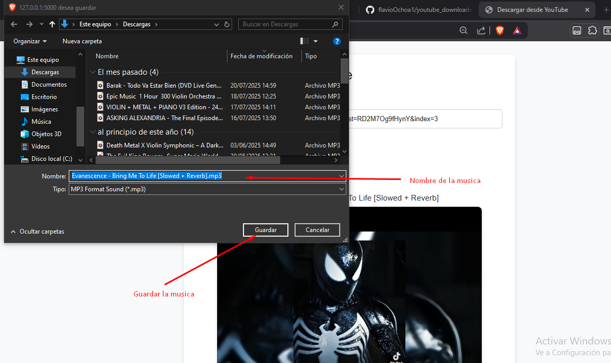

# YouTube Downloader Web 🎬🔻

Aplicación web que permite la descarga de videos de YouTube en formatos MP3 y MP4. Desarrollada con Python y Flask, esta herramienta facilita la conversión y descarga directa de contenidos audiovisuales mediante una interfaz sencilla y funcional.

---

## 🧰 Tecnologías utilizadas

- **Python 3.x**
- **Flask** – Framework web ligero
- **pytube** – Para la extracción de datos y descarga desde YouTube
- **HTML5 / CSS3** – Interfaz de usuario básica
- **Bootstrap (opcional)** – Para mejorar el diseño responsivo
- **Jinja2** – Motor de plantillas (incluido con Flask)

---

## 🚀 Funcionalidades

- Ingreso de URL de YouTube
- Extracción automática de información del video (título, miniatura, duración)
- Selección de formato de descarga: `.mp4` (video) o `.mp3` (audio)
- Descarga directa desde el navegador
- Validación de enlaces

---

## 📷 Capturas de Pantalla

* Pantalla principal

* Copiar enlace

* Pegar enlace

* Guardar
